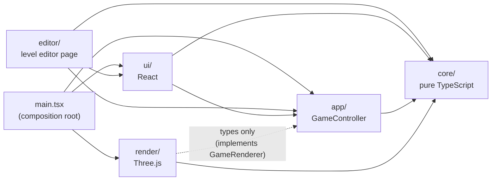
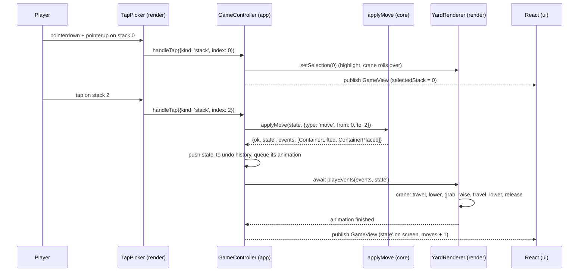

# Architecture

Stackhaven is split into four layers with one-way dependencies. The rules are
enforced by ESLint (`eslint.config.js`), so crossing a boundary is a lint error.

| Layer    | Job                                                                                        | May import               |
| -------- | ------------------------------------------------------------------------------------------ | ------------------------ |
| `core`   | The rules. Types, `applyMove`, rules, level schema (zod), undo history, stars, solver stub | nothing (only zod)       |
| `app`    | The glue. `GameController` owns all mutable state and talks to the renderer via a port     | `core`                   |
| `render` | Three.js scene: yard, crane, trucks, animation of events, picking                          | `core`, types from `app` |
| `ui`     | React HUD, level select, result modal                                                      | `core`, `app`            |
| `levels` | Level JSON files                                                                           | –                        |
| `editor` | The level editor page (`editor.html`): 2D React, reuses core's rules and schema            | `core`, `app`, `ui`      |

## Following one move through the code

The player taps stack 0, then stack 2:

Where to look:

1. `src/render/TapPicker.ts` – pointer events → raycast → `TapTarget`.
2. `src/app/GameController.ts` – `handleTap` decides select / move / deliver; `commit` applies it.
3. `src/core/engine.ts` – `applyMove`: validate with the rules, `perform` the move, run `afterMove` rules.
4. `src/render/YardRenderer.ts` – `playEvents` → `animate(event)` for each event.
5. `src/ui/useGameView.ts` – React re-renders from the new `GameView`.

## Key ideas

**`applyMove` is a pure function.** `(state, move) → { state, events }` or an
error. It never mutates its input and has no side effects. That makes it easy
to test, makes undo trivial (keep the old states), and lets a solver call it
millions of times.

**Events describe what happened.** The core does not know about cranes or
trucks; it reports facts (`ContainerLifted`, `ContainerPlaced`,
`ContainerDelivered`, `LevelWon`, `LevelLost`). The renderer turns each fact
into an animation. Game logic never lives in the renderer.

**Rules are a pipeline.** A `Rule` can `validate` a move before it happens and
react `afterMove`. Version 1 is `STANDARD_RULES`. A future mechanic (locked
stacks, reefers, storms) is a new rule added to the list; see the custom-rule
tests in `src/core/engine.test.ts`.

**Ports and adapters.** `app/ports.ts` defines `GameRenderer`, the interface
the controller needs. `YardRenderer` implements it with Three.js; the tests use
a fake. So `app` never depends on Three.js, and the dependency points inwards.

**Input is queued, never blocked.** The controller keeps two states: the
_logical_ state (`history.present`), which every tap is checked against, and
the _shown_ state, which lags behind while animations play. A legal move is
applied at once and its events join a queue that the renderer plays in order,
faster while moves are waiting (`setBacklog`). Undo and restart abandon the
queue and call `renderer.showState`, which aborts the running animation (a
generation counter tells stale animation code to stop). The HUD shows the
shown state, so it changes together with the 3D scene.

**Picking follows what is drawn.** A tap is raycast against the visible
containers, slot markings and trucks, and the hit's column decides the target;
if nothing is hit, the stack nearest on screen within a finger's width wins
(`render/picking.ts`).

**One owner of mutable state.** Everything that changes during play (level,
undo history, selection, animation lock, best stars) lives in
`GameController`. React reads immutable `GameView` snapshots with
`useSyncExternalStore`.

## Rendering notes

- Containers are one `InstancedMesh`: one draw call for all of them. Each
  container id keeps a fixed instance index.
- The camera is fitted to the yard's bounding box between the HUD bars, and
  steeper in portrait than in landscape (`render/camera.ts`).
- The scene renders only while something moves or has changed.
- Lighting: `HemisphereLight` + one shadow-casting `DirectionalLight`,
  ACES tone mapping, sRGB output, pixel ratio capped at 2.
